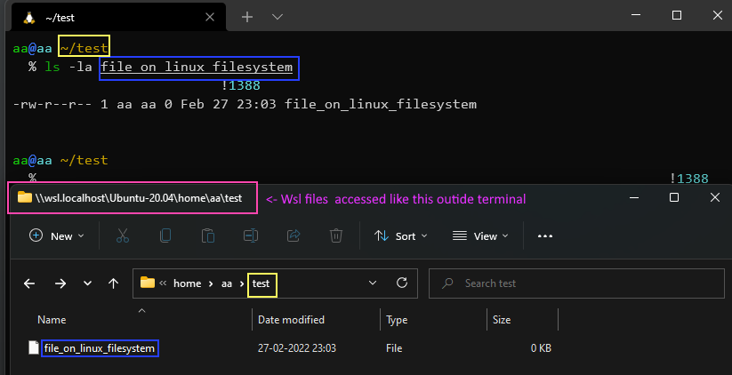
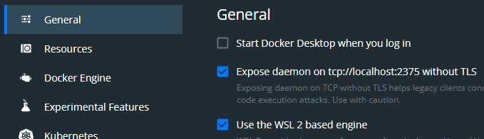
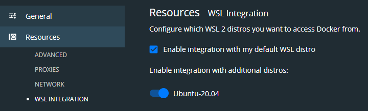
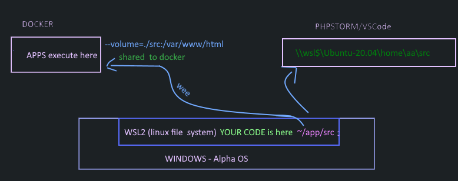
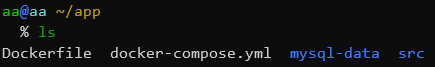
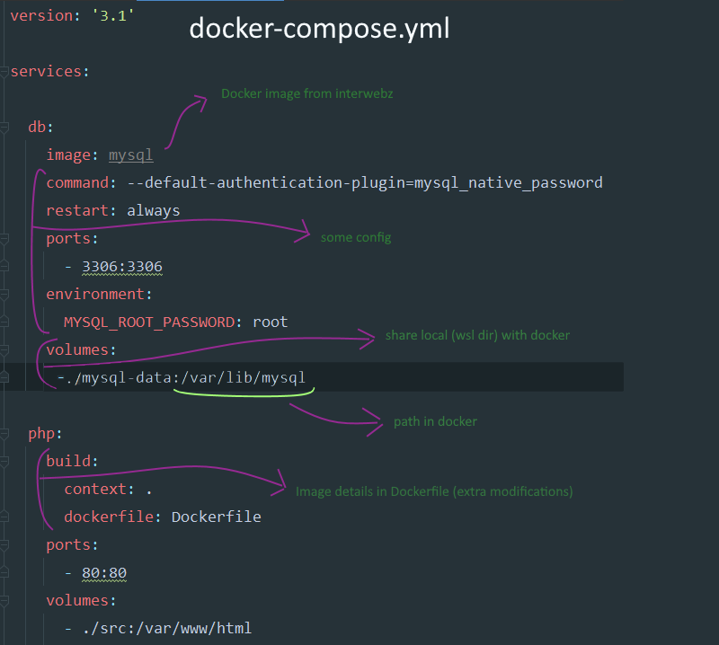

# docker-setup-lamp-guide

Concise guide for setting LAMP with WSL2 and debugging

## Intro

Setup Perfect linux dev environment on windows for PHP. Fuck mucking with linux GUI

## Theory. What is docker, wsl2

**WSL 2** - windows now ships with linux. alternative to dual booting or virtualbox

**Docker** - very very light single applications, such as PHP, mysql running in virtual environments. Get tested working 'images' of these, instead of messing with installing

## Setting up Environment

### WSL2

- Enable wsl > install and run a distro > open 'windows terminal' > Google it
- WSL2 ships with a 'real' linux file system. 

We keep ALL our source code in wsl filesystem. Helps with compatibility, permissions. Like using a normal linux trainwreck distro.

### Docker 

- Download > install > start dashboard . Enable following:

- Restart docker. start dashboard. Enable following

  

## Final setup 

## Configure docker

- Get docker 'images' or 'containers' from the interwebz (single applications like PHP, mysql) -> Configure these images - settings, users, directories etc > run them as one application

Configuration aims: 

- PHP - install extensions, set timezone, php.ini settings
- mysql - user, password, port
- directories- source code, mysql data dir 

This Repo -> shows configuring images of PHP, Mysql, apache and adminer. 

## Setup remote Debugging

TODO

# Detailed docker config explanation 

- **docker-compose.yml** - main config -> list images , some configurations
- **dockerfile** - builds or configures single image. We Use for heavy modifcations to php-apache image
- **mysql-data , src** -> local dir holding source code, mysql-data

## docker-compose.yml

## DOCKERFile

This is big topic. Configuration options are vast!

TODO

## Quick instructions for running

- Download files from the repo > cd to dir 

- ` docker compose up -d`    -  creates docker app, starts virtual environment. 

- **Connect to virtual instance** : For running scripts like inside a normal linux terminal

  - ` docker compose exec php zsh`  > `cd /var/www/html` > `php test.php`

- copy code to ./src . In browser -> localhost 

- **connect to mysql** > 

  - USER: root | PASS: root
  - HOSTNAME: from windows 'localhost' | from wsl 'localhost' | from another docker app like PHP image - *Not* `localhost` Get from docker dashboard. Mine is `docker-db-1` | 

- PHPstorm debugging:

  TODO

- VScode debuggin

  TODO

